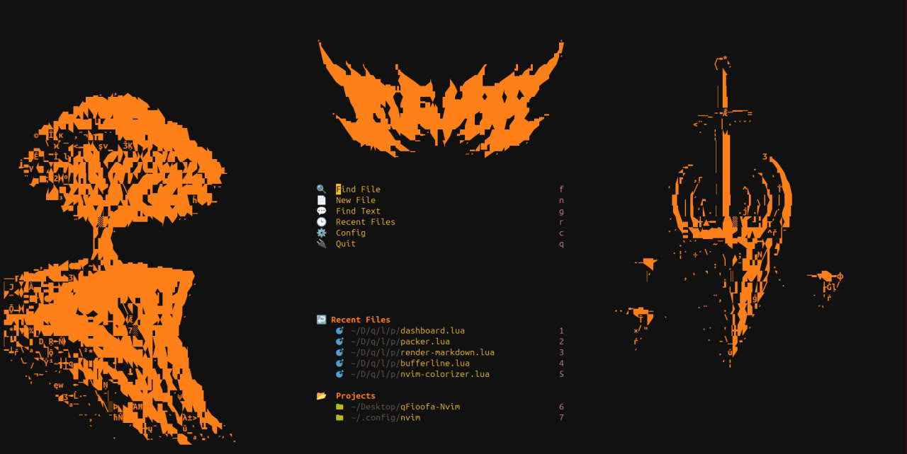

# qFioofa-Nvim
Personal Nvim config.

# Fast installation

## Linux

```bash
git clone --depth 1 --filter=blob:none --sparse https://github.com/qFioofa/qFioofa-Nvim.git ~/.config/nvim && cd ~/.config/nvim && git sparse-checkout init.lua lua/
```

**WARNING: prev config will be deleted. Make sure to make backup**
```bash
rm -rf ~/.config/nvim && git clone --depth 1 --filter=blob:none --sparse https://github.com/qFioofa/qFioofa-Nvim.git ~/.config/nvim && cd ~/.config/nvim && git sparse-checkout init.lua lua/
```

## Windows

_TODO: make windows fast installation_

# Instalation

There is other approuch to set the config.
_Make sure you got `git` installed_


Clone repo to Desktop locatip
**Note: replace `~/Desktop` with your folder if needed**
```bash
git clone https://github.com/qFioofa/qFioofa-Nvim.git ~/Desktop
```

Enter the repo
```bash
cd qFioofa-Nvim
```

## Linux

```bash
bash deploy_config.sh
```

## Windows

> Run `deploy_config.bat`

or

```powershell
bat deploy_config.bat
```

# Full wipe

## Linux

```bash
rm -rf ~/.config/nvim ~/.local/share/nvim ~/.cache/nvim ~/.local/state/nvim
```

# Config showcase 



# Useful

You can install all fonts from `Nerds fonts` from this [sourse](https://github.com/ryanoasis/nerd-fonts?tab=readme-ov-file#option-7-install-script)

Check size of pluings:

```bash
du -ch ~/.local/share/nvim/lazy/* | tail -1
```
