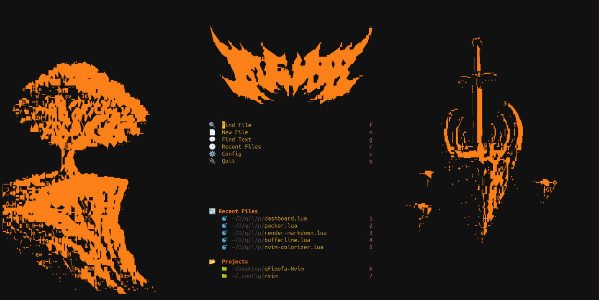

# qFioofa-Nvim

Personal Nvim config.

## Legend / Table of Contents

- [About](#about)
- [Features](#features)
- [Prerequisites](#prerequisites)
  - [Outside dependencies](#outside-dependencies)
- [Installation](#installation)
  - [Linux](#linux)
  - [Windows](#windows)
- [Fast Installation](#fast-installation)
  - [Linux](#linux-1)
  - [Windows](#windows-1)
- [Full Wipe](#full-wipe)
  - [Linux](#linux-2)
  - [Windows](#windows-2)
- [Config Showcase](#config-showcase)
- [Useful Commands](#useful-commands)

## About

This is my personal Neovim configuration aimed at providing a modern, efficient, and feature-rich editing environment.

## Features

- **LSP Support:** Integrated Language Server Protocol for real-time code diagnostics and completions.
- **Tree-sitter:** Enhanced syntax highlighting and parsing.
- **Telescope:** Powerful fuzzy finder for files, buffers, live grep, and more.
- **Treesitter:** Fast and incremental parsing library.
- **Lualine:** Lightweight status line.
- **Nvim-tree:** File explorer.
- **Dashboard:** Custom startup screen.
- _(Add more features based on your actual plugins)_

## Prerequisites

Before installing, ensure you have the following software installed:

- **Git:** Required for cloning the repository.
- **Neovim:** Version 0.11.5 or higher is recommended (`nvim --version`).

### Outside dependencies

Image viewer protocol

```bash
sudo apt install imagemagick
```

### Installing Prerequisites (Examples)

#### Linux (Ubuntu/Debian)

```bash
sudo apt update
sudo apt install git
sudo apt install neovim
```

#### Windows

- **Git:** Download from [git-scm.com](https://git-scm.com/download/win)
- **Neovim:** Download the latest release from [GitHub Releases](https://github.com/neovim/neovim/releases/tag/stable) (extract the archive and add `nvim-win64\bin` to your PATH).

## Installation

This approach clones the repository to a local folder and runs a deployment script to set up the configuration in the correct location (`~/.config/nvim` on Linux, `~/AppData/Local/nvim` on Windows).

Make sure you have `git` installed.

### Linux

1.  Clone the repository to your Desktop (or preferred location):

    ```bash
    git clone https://github.com/qFioofa/qFioofa-Nvim.git ~/Desktop/qFioofa-Nvim
    ```

2.  Enter the cloned repository directory:

    ```bash
    cd ~/Desktop/qFioofa-Nvim
    ```

3.  Run the deployment script:
    ```bash
    bash deploy_config.sh
    ```

### Windows

1.  Clone the repository using Git Bash or Command Prompt:

    ```cmd
    git clone https://github.com/qFioofa/qFioofa-Nvim.git %USERPROFILE%\Desktop\qFioofa-Nvim
    ```

    _(Or use PowerShell: `git clone https://github.com/qFioofa/qFioofa-Nvim.git $env:USERPROFILE\Desktop\qFioofa-Nvim`)_

2.  Navigate to the cloned directory:

    ```cmd
    cd %USERPROFILE%\Desktop\qFioofa-Nvim
    ```

    _(Or in PowerShell: `Set-Location $env:USERPROFILE\Desktop\qFioofa-Nvim`)_

3.  Run the deployment batch script:
    ```cmd
    deploy_config.bat
    ```
    _(Or in PowerShell: `.\deploy_config.bat`)_

## Fast Installation

This method performs a shallow clone with sparse checkout directly into the Neovim configuration directory, potentially faster for initial setup but overwrites the existing config.

**WARNING: This will delete your previous Neovim configuration (`~/.config/nvim`). Ensure you have a backup if needed.**

### Linux

```bash
rm -rf ~/.config/nvim && git clone --depth 1 --filter=blob:none --sparse https://github.com/qFioofa/qFioofa-Nvim.git ~/.config/nvim
cd ~/.config/nvim
git sparse-checkout init --cone
git sparse-checkout set .
```

### Windows

```powershell
Remove-Item "$env:LOCALAPPDATA\nvim" -Recurse -Force -ErrorAction SilentlyContinue
git clone --depth 1 --filter=blob:none --sparse https://github.com/qFioofa/qFioofa-Nvim.git $env:LOCALAPPDATA\nvim
Set-Location $env:LOCALAPPDATA\nvim
git sparse-checkout init --cone
git sparse-checkout set .
```

## Full Wipe

Completely remove Neovim configuration and associated data directories.

### Linux

```bash
rm -rf ~/.config/nvim ~/.local/share/nvim ~/.cache/nvim ~/.local/state/nvim
```

### Windows

Using PowerShell:

```powershell
Remove-Item "$env:LOCALAPPDATA\nvim", "$env:LOCALAPPDATA\nvim-data", "$env:TEMP\nvim*" -Recurse -Force -ErrorAction SilentlyContinue
```

Using Command Prompt (CMD):

```cmd
rmdir /s /q "%LOCALAPPDATA%\nvim" "%LOCALAPPDATA%\nvim-data" "%TEMP%\nvim*" 2>nul
```

## Config Showcase



## Useful Commands

- **Install Nerd Fonts (Linux):** Follow instructions from the [source](https://github.com/ryanoasis/nerd-fonts?tab=readme-ov-file#option-7-install-script). Example using the install script:

  ```bash
  ./install.sh JetBrainsMono
  ```

  Alternative for Linux: Use package manager if available, e.g., `sudo apt install fonts-font-awesome` or specific nerd font packages if in repos like AUR or Extra.

- **Install Nerd Fonts (Windows - PowerShell):** Use the PowerShell installer (requires PowerShell 7+ or Windows PowerShell 5.1).

  ```powershell
  Install-PSResource -Name NerdFonts
  Import-Module -Name NerdFonts
  Install-NerdFont -Name 'FiraCode'
  ```

  Alternative for Windows: Use Chocolatey or Scoop as mentioned in the Nerd Fonts docs.

- **Check Plugin Sizes (Linux):** Estimate the disk space used by installed plugins managed by lazy.nvim:

  ```bash
  du -ch ~/.local/share/nvim/lazy/* | tail -1
  ```

- **Check Plugin Sizes (Windows - PowerShell):** Estimate the disk space used by installed plugins managed by lazy.nvim:
  ```powershell
  (Get-ChildItem "$env:LOCALAPPDATA\nvim-data\lazy" -Recurse -File | Measure-Object -Property Length -Sum).Sum / 1MB
  ```
  _(This command calculates the total size in MB. Adjust path if necessary.)_

# Switch caps

- For better experince it is better to spaw `Caps` and `Ctrl` keys so your pinkie won't calaps

Ubuntu

```bash
gsettings set org.gnome.desktop.input-sources xkb-options "['ctrl:swap_caps']"
```

Reset all changes

```bash
gsettings reset org.gnome.desktop.input-sources xkb-options
```
